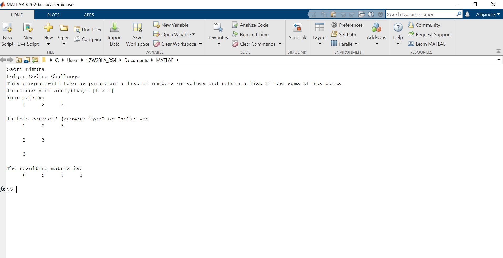
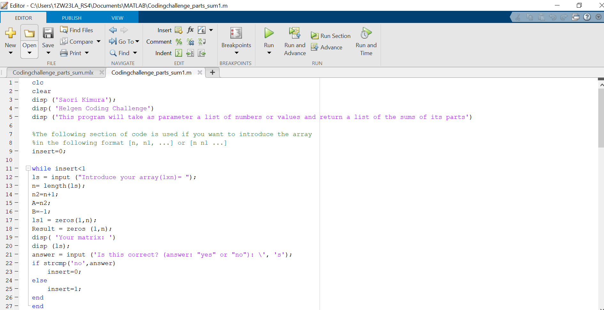

<h1 align="center">Coding Challenge</h1>

## Description
Matlab code where it takes as parameter a 1xn array of values and returns a an array of the sums of its parts, as follows:

Given the following array:
ls = [0, 1, 3, 6, 10]

Its following parts:

ls = [0, 1, 3, 6, 10]

ls = [1, 3, 6, 10]

ls = [3, 6, 10]

ls = [6, 10]

ls = [10]

ls = []

The corresponding sums are: [20, 20, 19, 16, 10, 0]

In order to achieve this, the array in question is shifted clockwise by one using circular shifting. Then a new array is created that is shorter in length by one than the previous array and therefore excluding the last value of that array, which corresponds to the first value of the array before the shift. Lastly, the values all of the new array are added using a sum fuction and stored in the final array that will show the sum of all of the part of the array in question. This process is repeated until the sum of the resulting array is equal to zero, which is done through a for statement that will repeat the process for the length of the list + 1. At the beggining of the code, there is an option to revise the list of values or array introduced and re-enter them if needed, this was done through a simple structure with an if statement within a while statement and it was made a little more user firendly by using string variables and then assigning a numerical value to use them within the code. 

## Built With
- Matlab

## Software
- Matlab online:https://es.mathworks.com/products/matlab-online.html
- Download Matlab (license needed): https://www.mathworks.com/downloads/

## Screenshots

**Saori Kimura**

- [Profile](https://github.com/saorikt98 "Saori Kimura")
- [Email](mailto:saori.kt98@gmail.com?subject=Hi% "Hi! Contact Me!")

## Contributions
Contributions, issues, and feature requests are welcome!
Give a ⭐️ if you like this project!
